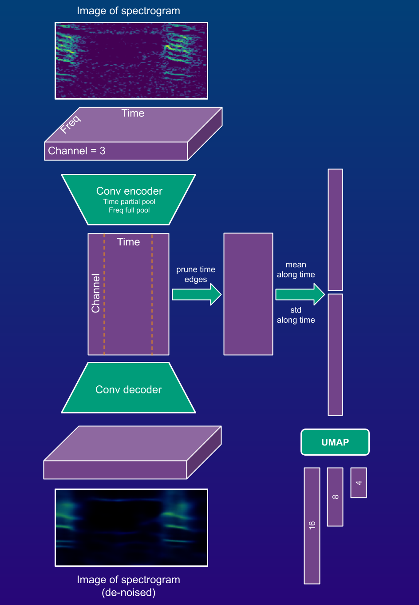

# Compact auto-encoders for feature extraction from acoustic spectrograms  

### Overview
* Define and train simple custom Pytorch auto-encoders for spectrograms
* Extract array features with these auto-encoders and convert them to linear features (details in pic below)
* Auto-encoders perform partial pooling of time axis (latent array representation is 2D -> channel by time)
* Specific data loader for spectrogram data to train under de-noising regime
* All functionality is called from 3 classes defined in **utils.py**
* Extracted features are meant to be used in companion [project](https://github.com/sergezaugg/spectrogram_image_clustering) and its [frontend](https://spectrogram-image-clustering.streamlit.app/)

### Usage 
* Prepare PNG formatted color images of spectrograms, e.g. with [this tool](https://github.com/sergezaugg/xeno_canto_organizer)
* Download this repo and install dependencies
* Set paths where models will be saved and fetched in **config/config.yaml**
* Run **main_00_make_models.py** to prepare the naive (randinit) auto-encoder models (run just once)
* Set training session parameters in a json file in **./training_session_params/**
* **main_01_train.py** illustrates a pipeline to train auto-encoders, session params passed via a json file
* **main_02_extract.py** illustrates a pipeline to extract array features and get dim-reduced linear features, params currently defined in script header
* Array and dim-reduced features are written to disk as NPZ files in parent of dir with images

### Dependencies / Intallation
* Developed under Python 3.12.8
* Make a fresh venv!
* Install basic packages with
* ```pip install -r requirements.txt```
* Ideally **torch** and **torchvision** should to be install for GPU usage
* This code was developed under Windows with CUDA 12.6 
* ```pip3 install torch torchvision --index-url https://download.pytorch.org/whl/cu126```
* If other CUDA version or other OS, check official instructions [here](https://pytorch.org/get-started/locally)

### ML details



